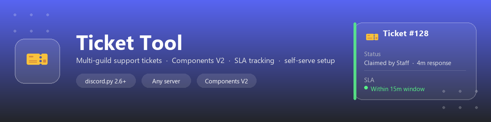

<div align="center">




[](https://discord.gg/P992BnNMbw)

</div>

# Ticket Tool

A feature-rich, **multi-guild** Discord ticket management bot built with discord.py, using
Discord's Components V2 layout system for every panel, embed, and log entry (no legacy
`discord.Embed` anywhere in the codebase).

Install it once, invite it to any number of servers — each server configures itself
independently with a single `/setup` command. There's no hardcoded guild, role, or
channel anywhere in the code; all of that lives in per-guild config saved to disk.

## What makes this different

Most ticket bots stop at "open a channel, close a channel." This one tracks whether your
team is actually **responding**, not just resolving:

- **First-response SLA tracking** — every ticket silently tracks the time from open to the
  first real staff message. If nobody replies within your configured window (default 15m),
  the bot pings your staff role once in-channel and logs a breach to your escalation
  channel — before the user gets frustrated and leaves, not after.
- **SLA visibility in the live report** — the self-updating stats panel shows average
  first-response time and how many closed tickets never got a reply at all, alongside the
  usual open/closed counts and top-staff leaderboard.
- **Repeat-ticket detection** — if a user opens a ticket on the same topic they already
  had closed recently, staff get an instant note in the new ticket linking the prior one
  and its resolution — no digging through history to spot a repeat complaint.
- **Channels or threads, your choice** — `/setup ticket_mode:` lets each server pick
  between a classic separate-channel-per-ticket layout or private-thread tickets that
  live inside one channel, whichever fits how the server is organized.
- **Fully self-serve, zero code changes per server** — one `/setup` command configures
  everything; there is no bot-owner allowlist gating a server's ability to use it.
- **No misbehaving timeouts** — every ticket button, panel, and dropdown is a persistent
  view (stable `custom_id`, re-registered on every restart), so controls never silently
  stop working after a Discord view timeout or a bot redeploy.

Everything here works entirely through normal bot API calls (slash commands, buttons,
channel messages) — no self-botting, scraping, or mass-DM behavior, so it stays well
within Discord's Terms of Service and Developer Policy.

## Features

- **One-command setup** — `/setup` configures your panel, ticket category, closed
  category, transcript channel, and staff/admin roles in a single interaction.
- **Ticket Panels** — Dropdown menu or button-based panel, fully custom labels/emojis.
- **Ticket Lifecycle** — Open, claim, close, reopen, delete, transfer, escalate — all
  with proper per-guild permission management.
- **Transcripts** — Automatic JSON transcript generation, archived per ticket and DM'd
  to the creator on close.
- **Rating System** — 1–5 star rating DM sent after ticket close, with an optional
  review-log channel and a public `/reviews` command.
- **Rate Limiting** — Configurable max open tickets and cooldown, per server.
- **Escalation & Transfer** — Escalate to an admin role or hand a ticket to another
  department role.
- **Auto-Close** — Configurable inactivity timeout auto-closes stale tickets.
- **Auto-Permission Repair** — Periodic + on-demand audit that re-grants the bot access
  to every configured ticket channel/category.
- **Daily Reports** — A live, self-updating stats panel per server (opt-in via
  `!report_channel`).
- **Global Error Handling** — Errors are reported to the guild's configured error
  channel when set, so each server's admins see their own issues.
- **Components V2 throughout** — every message the bot sends (panels, tickets, logs,
  transcripts, reviews, reports) is built from `Container`/`Section`/`TextDisplay`
  components, not embeds.

## Requirements

- Python 3.11+
- Discord Bot Token with the `bot` and `applications.commands` scopes
- Required intents: Message Content, Server Members, Guilds, Messages, Reactions
  (enable "Message Content Intent" and "Server Members Intent" in the Developer Portal)

## Setup

1. Copy `.env.example` to `.env` and fill in at least `DISCORD_TOKEN`:
```
DISCORD_TOKEN=your_bot_token
```
Everything else in `.env` is optional — see the comments in `.env.example`. You do
**not** need to set `OWNER_IDS` for the bot to work; every server's administrators can
fully configure and run their own ticket system with just `/setup`.

2. Run:
```
python main.py
```
`main.py` bootstraps itself — first run creates a local `venv/`, installs
`requirements.txt` into it, then relaunches inside that venv automatically. Normal
restarts after that are effectively instant (no reinstall). Set `TICKETBOT_NO_BOOTSTRAP=1`
to skip this and use whatever interpreter is already active, or run
`pip install -r requirements.txt` yourself first if you'd rather manage the venv by hand.

Deploying long-term on a VPS? See [`deploy/README.md`](deploy/README.md) for a systemd
service + a scheduled daily restart timer.

3. In each Discord server, an administrator runs:
```
/setup staff_role:@Support
```
That's it — the panel is posted, categories/channels are created if missing, and the
ticket system is live for that server.

Slash commands sync **globally** by default (works on any server, no per-guild
allowlist needed) — this can take up to an hour to propagate to Discord clients the
first time. Set `DEV_GUILD_ID` in `.env` while developing to sync instantly to one
test server instead.

## Commands

### Slash Commands

| Command | Description | Permission |
|---|---|---|
| `/setup` | One-command setup: panel, ticket mode (channels/threads), categories, roles, channels | Administrator |
| `/ticket option add` | Add an option to an existing panel | Staff |
| `/ticket option edit` | Edit a ticket option | Staff |
| `/ticket option remove` | Remove an option from a panel | Staff |
| `/ticket panel` | Re-send a panel to the current channel | Staff |
| `/ticket config` | Configure max tickets, cooldown, auto-close, SLA reminder, repeat-ticket window | Staff |
| `/ticket repair` | Audit and repair bot permissions | Staff |
| `/ticket rename` | Rename the current ticket channel | Staff |
| `/ticket add` | Add a member to the current ticket | Staff |
| `/ticket remove` | Remove a member from the current ticket | Staff |
| `/ticket transcript` | Get the JSON transcript of the current ticket | Creator/Staff |
| `/ticket bulk_transcript` | Export all ticket transcripts for the server | Staff |
| `/ticket close` | Close the current ticket (fallback if buttons fail) | Creator/Staff |
| `/reviews` | View public support rating stats | Everyone |

"Staff" means: server Administrators, the role(s) set via `/setup staff_role:` /
`staff_role_2:`, or a bot operator listed in `OWNER_IDS`.

### Ticket Channel Buttons

| Button | Description |
|---|---|
| Claim | Claim an unclaimed ticket |
| Escalate | Escalate to the configured admin role |
| Transfer | Transfer to another department role |
| Close | Close ticket with a reason |
| Transcript | Download the JSON transcript |
| Reopen | Reopen a closed ticket |
| Delete | Delete the channel and send the transcript |

## Project Structure

```
├── main.py                # Entry point: intents, cog loader, global command sync
├── cogs/
│   ├── ticket.py          # Core ticket system — panels, lifecycle, per-guild config
│   ├── owner.py           # Server + bot stats commands
│   ├── commands.py        # Diagnostic commands (sync, channel-limit test)
│   ├── presence.py        # Rotating bot presence
│   ├── report.py          # Self-updating per-guild stats report
│   └── errorhandler.py    # Global error handling
├── core/
│   ├── config.py          # Bot configuration from .env (global, operator-level only)
│   ├── design.py          # Components V2 design system (Colors, PanelView, EntryView)
│   └── utils.py           # Shared embed/panel helpers
└── Data/                  # Created at runtime — never committed
    ├── config.json        # Panel, option & per-guild server_config definitions
    ├── tickets.db          # SQLite ticket + message + review database
    ├── tickets/            # JSON per-ticket transcript backups, one folder per guild
    └── reports/            # Per-guild live-report message anchors
```

## Configuration model

There are two layers of configuration:

- **Bot operator config** (`.env`, `core/config.py`) — the Discord token, an optional
  list of bot-operator user IDs (`OWNER_IDS`) that bypass all per-guild checks, and a
  couple of cosmetic/optional values (presence text, brand name, a fallback error
  channel). None of this is required for a server to use the bot.
- **Per-guild config** (`Data/config.json`, under `server_config.<guild_id>`) — every
  server's staff role, admin role, categories, channels, and ticket limits. Set
  entirely through `/setup` and `/ticket config` — no code changes or bot restarts
  needed to onboard a new server.

`Data/` is gitignored and persists on disk across restarts/redeploys as long as the
directory itself isn't deleted — back it up if you redeploy to a new host.

## Support

Questions, setup help, bug reports, or feature ideas: join the Discord —
https://discord.gg/P992BnNMbw
